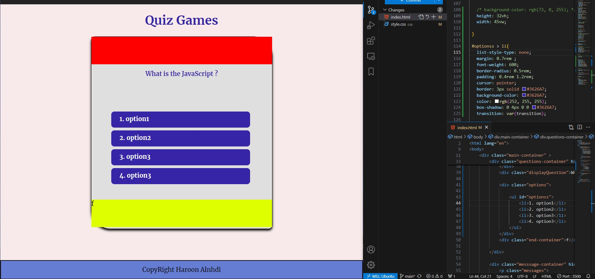
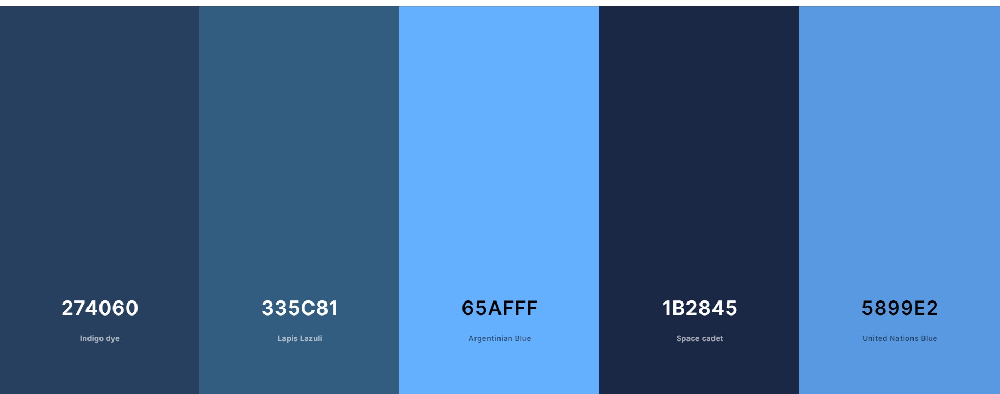
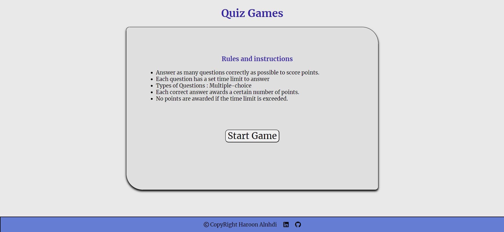
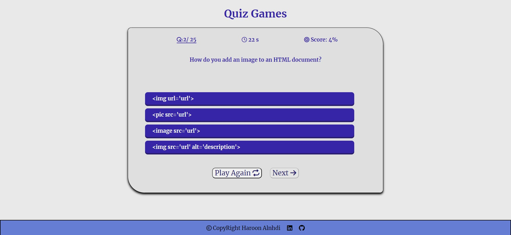
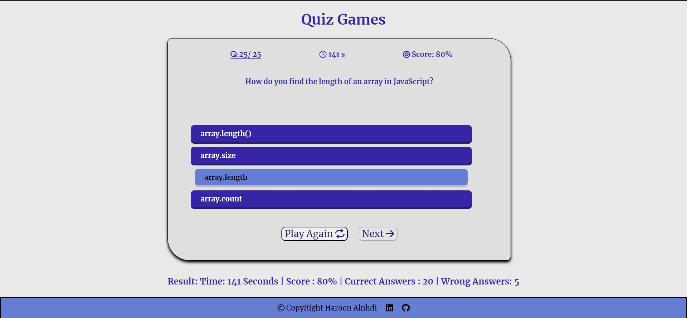

<h1 align="center">Quiz Game</h1>

#### Date: 10/7/2024
#### By: Haroon Ali Alnhdi

#### [GitHub](https://github.com/HaroonAlnhdi) | [LinkedIn](https://www.linkedin.com/in/haroon-alnhdi-849048309/) 
***

<h2 align="center">Description</h2>

Quiz games are interactive games designed to test and enhance a player's knowledge on various topics through a series of questions. These games can be played individually or in groups, and they often feature multiple-choice questions.

<b>User Stories</b>

1. The user should be able to see a landing page when I arrive at the website to know I'm in the right place.
2. The user must be able to see the "start game" button.
3. The user should be able to see one question at a time with multiple answer options.
4. The user must be able to select an answer for each question.
5. The user should be able to see feedback after selecting.
6. The user should be able to proceed to the next question.
7. The user should be able to view the total score.
8. The user should be able to view time of the questions.

<b>How To Play</b>

1. **Start a Quiz:** Click start quiz.
2. **Read the Question**: Carefully read the displayed question.
3. **Choose an Answer**: Click on the option that you think is correct.
4. **Submit Your Answer**: Click the "Next" button to submit your answer and move to the next question.
5. **View Results**: At the end of the quiz, view your score, time taken, and correct/incorrect answers.
6. **Play Again**: To play the game again.

<b>Technologies Used</b>

* HTML
* CSS
* JavaScript
* GitHub
***

<h2 align="center">Getting Started</h2>

##### The project itself was deployed and can be viewed [here](https://haroonalnhdi.github.io/Quiz-Game/).

***

<h2 align="center">Screenshots</h2>

<b>Project layout</b>

This image shows the overall layout of the project, highlighting the structure and user interface elements.

<b>Colors</b>

This image displays the color scheme used throughout the quiz game, demonstrating the visual design and aesthetic.

<b>Home Page</b>

The home page of the quiz game, where users can start the quiz and access other features.

<b>Question Page</b>

An example of a question page, showing a single question with multiple answer options for the user to choose from.

<b>Display Result</b>

The results page, where users can see their final score, time taken, and a summary of correct/incorrect answers.

### ***Future Updates***

- [ ] Get questions from API
- [ ] Implement different difficulty levels (easy, medium, hard)
- [ ] Add a timer for each question and deduct points for slow responses
- [ ] Include multimedia questions (images, audio, video)
- [ ] Add more diverse question categories
- [ ] Integrate social media sharing to post scores

- [x] Added message hiding after 1 second.
- [x] Display final result without hiding the message.
- [x] ~~Updated UI for better user experience~~.
***
### ***Credits***

##### Javascript Reference: [JS Search](https://www.thaicreate.com/javascript-manual/index.htm)

##### Colors: [Coolors.com](https://coolors.co/d6e681-babf95-c4ad83-c6b677-dbb957)

##### Icoins: [fontawesome.com](https://fontawesome.com/search)
##### HTML elements reference: [developer.mozilla](https://developer.mozilla.org/en-US/docs/Web/HTML/Element)

***
